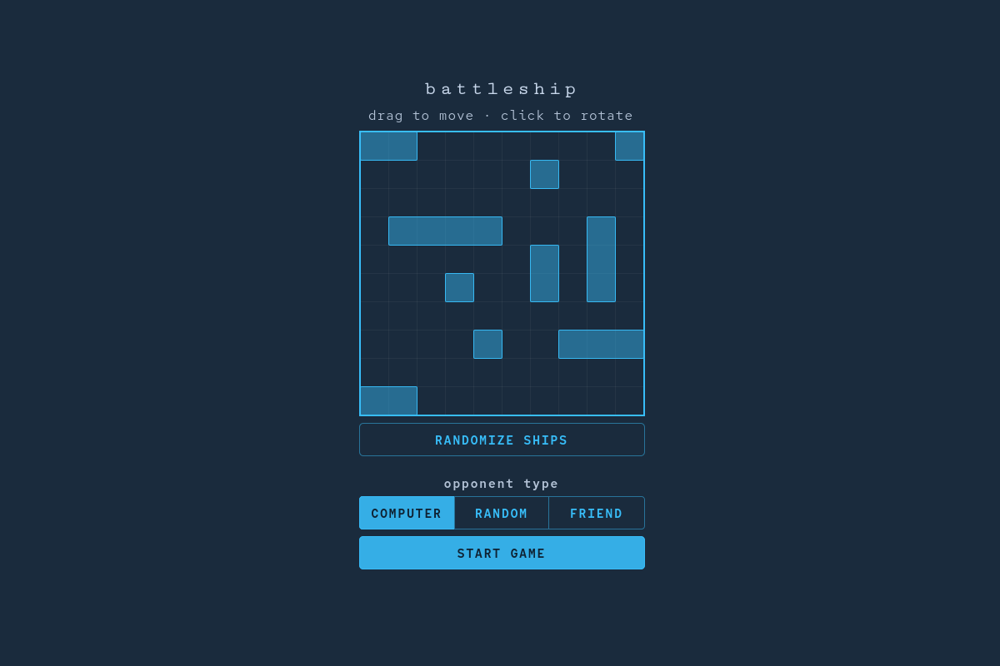
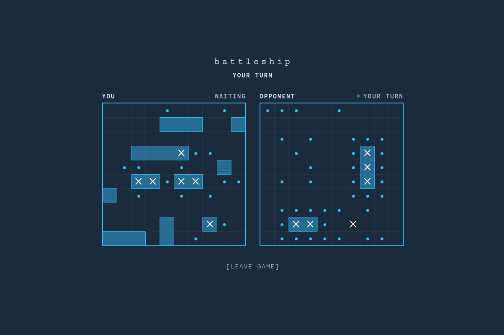
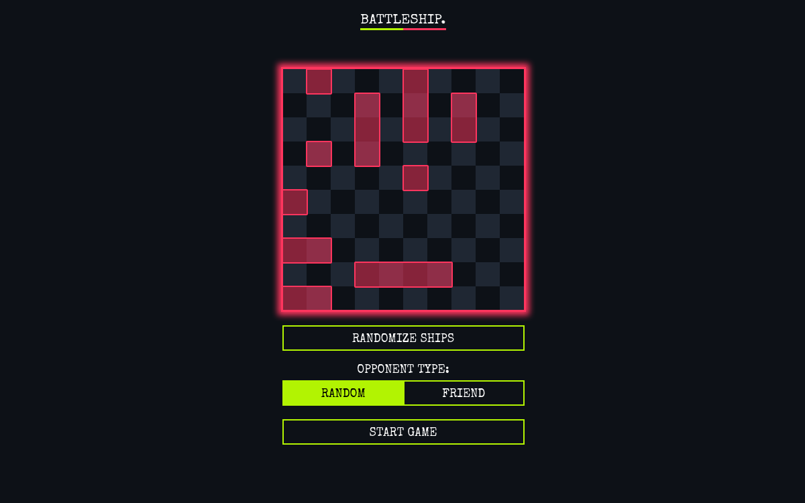
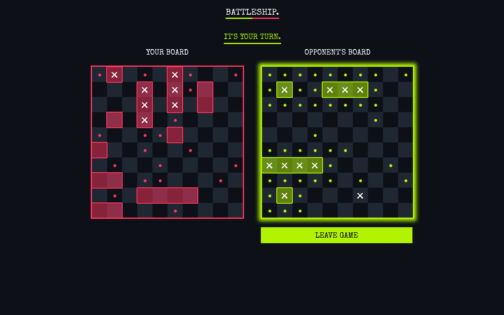

## Overview
A full-stack real-time Battleship game where players can play against a random opponent or a friend via a shareable link.  
**Live demo:** [https://battleship.liashchevska.com/](https://battleship.liashchevska.com/)
<details>
    <summary>Screenshots</summary>
    
    
</details>

## Built With
**Backend:** Django, Django Channels, Django REST Framework  
**Frontend:** Vue, Vue Router, Vuex, Vite, SCSS  
**Database:** PostgreSQL  
**Infrastructure:** Docker Compose, Nginx, Certbot  

## Upgrade
This project was originally developed a few years ago using Vue 2 and Django 3. As part of this upgrade, it was migrated to Vue 3 and Django 5, with dependencies updated across the stack. The UI was refreshed to provide a more modern look and feel, and the application was containerized with Docker Compose, with Nginx serving as a reverse proxy for deployment. Also, a single-player mode was added with computer as an opponent.

### Before
<p align="left">
    
    
</p>

### After
<p align="left">
    
    
</p>

## Local Development
Clone the repository:
```bash
git clone https://github.com/liashchevska/battleship-game.git
cd battleship-game
```
Create a .env file based on .env.template and populate the required environment variables.

Start the application with Docker Compose:
```bash
docker compose -f dev.docker-compose.yaml up
```

The frontend runs with Vite's development server and supports hot module replacement (HMR) during development.
